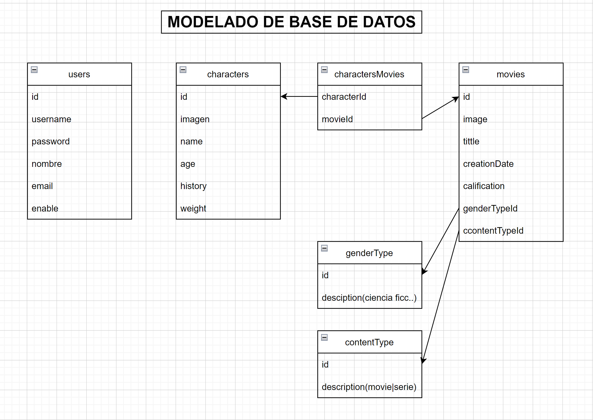

# CHALLENGE BACKEND NodeJs 🚩
 

### OBJETIVO 🎯

Desarrollar una API para explorar el mundo de Disney, la cual permitirá conocer y modificar los
personajes que lo componen y entender en qué películas estos participaron. Por otro lado, deberá
exponer la información para que cualquier frontend pueda consumirla.
 
[Link de los objetivos del challenge](https://drive.google.com/file/d/1XCUYgTFaE9uBNI-FqKDWIa4RCztooz_X/view "ABRIR")

-Autenticación de Usuarios(JWT)
 
-CRUD(create, read, update, delete)
 
-Listado de persoajes 
 
-Detalle de personaje
 
-Búqueda de personajes
 
-Listado de películas
 
-Detalle de Pelicula/Serie con sus personajes
 
-Creación, edición y eliminación de película/serie
 
-Busqueda de Película o Series
 
-Test y Documentación con Postman
 
 

### TECNOLOGIAS 💻

* Lenguaje : Node JS
* Middleware : Express
* ORM : Sequlize
* SERVICE : AWS S3
* LIBRERIAS : MULTER
* BASE DE DATOS : MYSQL
* PATRON REST
* Postman
 
 

### MODELADO DE BASE DE DATOS 📊

 
 

### USO ⚙️

* DESCARGA: Descarga o clona el repositorio ->[Link](https://github.com/Jmoreyra93/nodejs-alkemy-challenge.git)
* INSTALACION PACKAGE JSON: `npm install` para descargar todos los paquetes utilizados
* RUN : `npm run dev` para correr la app

 
 

### ACLARACIÓN ⚙️

* .ENV : Las claves de AWS y MYSQL no se encuentran por obvias razonez.

 
 

### FALTANTE Y COSAS A MEJORAR

* Falta : Los detalles de Characters con las relaciones. No encuentro el error. Acepto críticas, mejoras, comentarios. Asi como también pueden preguntarme cualquier duda.
* Mejoras: Me encuentro en la creación de su front con react y bootstrap

